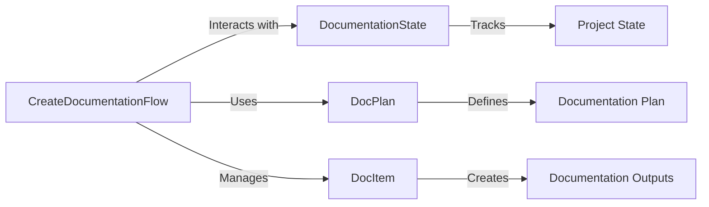

# DocumentationGenerator

DocumentationGenerator is a Python-based tool designed to automate the creation of high-quality documentation for GitHub repositories. The system uses modular components to clone repositories, analyze codebases, plan documentation, and generate structured outputs. It leverages AI tools for comprehensive and efficient documentation creation.

---

## Features

- **Automated Repository Cloning**: Clones the specified GitHub repository to a local workspace.
- **Documentation Planning**: Analyzes the repository to create a structured documentation plan.
- **Documentation Generation**: Drafts and reviews documentation based on a predefined plan.
- **Extensible Architecture**: Built with modular components and configuration-based workflows.

---

## Requirements

- Python 3.10+
- pip (Python package manager)
- NVIDIA API Key (for integration with NVIDIA NIM services)

---

## Installation

1. Clone this repository:

   ```bash
   git clone https://github.com/Matrisis/DocumentationGenerator.git
   cd DocumentationGenerator
   ```

2. Install dependencies:

   ```bash
   pip install -r requirements.txt
   ```

3. Configure your environment variables:

   - Create a `.env` file in the root directory:

     ```env
     NVIDIA_NIM_API_KEY=your_api_key
     ```

   - Alternatively, set the environment variable directly:

     ```bash
     export NVIDIA_NIM_API_KEY=your_api_key
     ```

---

## Usage

### Quick Start

1. Run the main script:

   ```bash
   python main.py
   ```

2. When prompted, provide the GitHub repository URL:

   ```
   Enter the GitHub repository URL: https://github.com/user/repository.git
   ```

3. The tool will:

   - Clone the repository.
   - Plan the documentation.
   - Generate the documentation in the `docs` directory within the cloned repository.

---

## System Architecture

### Core Components

1. **`CreateDocumentationFlow`**:
   - Orchestrates the entire documentation process, including cloning, planning, and generating documentation.

2. **`DocumentationState`**:
   - Maintains the current state of the documentation process.

3. **`DocPlan`**:
   - Defines the structure and content of the planned documentation.

4. **`DocItem`**:
   - Represents individual sections or components of the documentation.

### High-Level Workflow

1. **Repository Cloning**:
   - Clones the GitHub repository using the provided URL.

2. **Planning Phase**:
   - Analyzes the repository to identify key components and relationships.
   - Creates a structured plan for documentation.

3. **Documentation Creation**:
   - Drafts documentation based on the plan.
   - Reviews and finalizes the documentation.

### Mermaid Diagram



---

## Configuration

- **`planner_agents.yaml`**:
  Defines the agents responsible for analyzing and planning documentation.

- **`planner_tasks.yaml`**:
  Specifies tasks for analyzing the codebase and creating documentation plans.

- **`documentation_agents.yaml`**:
  Configures agents for drafting and reviewing documentation.

- **`documentation_tasks.yaml`**:
  Lists tasks for generating and reviewing documentation outputs.

---

## Example Code

### Initializing and Running the Documentation Flow

```python
from documentation_flow import CreateDocumentationFlow, DocumentationState

# Define the repository URL
project_url = "https://github.com/user/repository.git"

# Initialize state and flow
state = DocumentationState(project_url=project_url)
flow = CreateDocumentationFlow(state)

# Execute the flow
flow.run()
```

### Sample Configuration in `.env` File

```env
NVIDIA_NIM_API_KEY=your_api_key
```

---

## Output

- Documentation is generated in the `docs` directory of the cloned repository.
- Each section of the documentation is saved as a Markdown (`.mdx`) file.

---

## Contributing

1. Fork the repository.
2. Create a new branch:

   ```bash
   git checkout -b feature/your-feature
   ```

3. Commit your changes:

   ```bash
   git commit -m "Add feature X"
   ```

4. Push to your branch:

   ```bash
   git push origin feature/your-feature
   ```

5. Submit a Pull Request.

---

## License

This project is licensed under the MIT License.

---

## Acknowledgements

Built with ❤️ by Matthieu using CrewAI and NVIDIA AI integrations.
