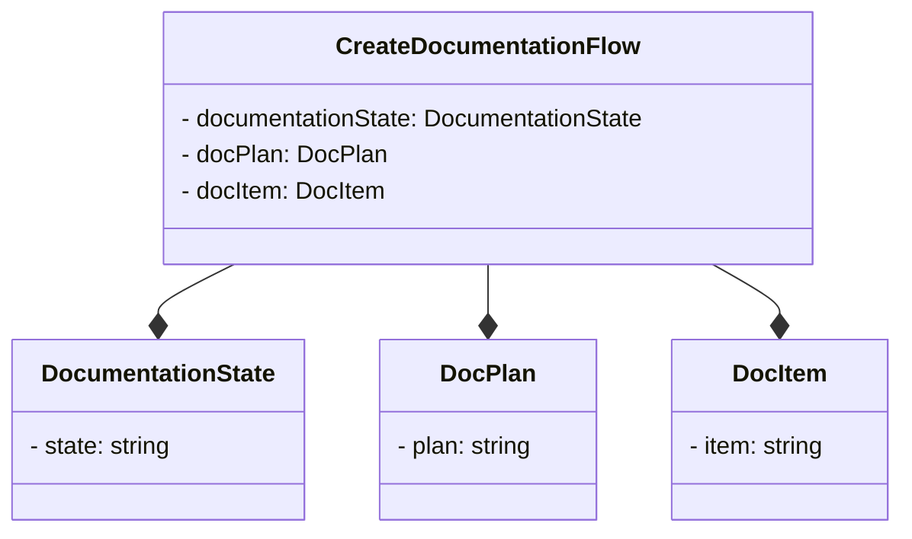

# System Architecture
The DocumentationGenerator project is a Python application that automates the creation of documentation for a given GitHub repository. The project consists of several components, including environment setup, repository cloning, documentation planning, and documentation creation.

## Components
The project uses a modular design, with the following components:
- **CreateDocumentationFlow**: This class interacts with the **DocumentationState** class to manage the state of the documentation.
- **DocumentationState**: This class is responsible for managing the state of the documentation.
- **DocPlan**: This class is responsible for planning the documentation.
- **DocItem**: This class is responsible for creating the documentation.

## Configuration
The project uses a configuration-based approach, with configuration files stored in the **config** directory. The configuration files include:
- **documentation_agents.yaml**: This file contains configuration for the documentation agents.
- **documentation_tasks.yaml**: This file contains configuration for the documentation tasks.
- **planner_tasks.yaml**: This file contains configuration for the planner tasks.
- **planner_agents.yaml**: This file contains configuration for the planner agents.

## Crew-Based Approach
The project uses a crew-based approach to manage the documentation flow. The **CreateDocumentationFlow** class interacts with the **DocumentationState** class to manage the state of the documentation.

## Setup Instructions
To set up the project, follow these steps:
1. Clone the repository from GitHub.
2. Install the required dependencies using pip: `pip install -r requirements.txt`.
3. Configure the project by editing the configuration files in the **config** directory.
4. Run the project using the **main.py** script.

## Mermaid Art Diagram
